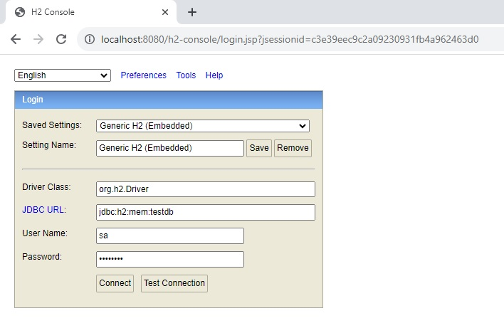
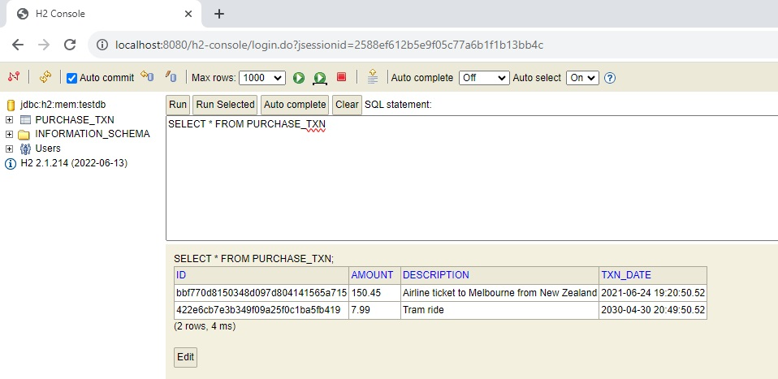

# purchase-api

App for storing and retrieving purchase transactions.

Implemented as a Spring Boot app. Once run, the app exposes RESTful API endpoints that the user can call to perform
purchase transaction operations: storing purchase transactions (which get persisted in a database), and retrieving
stored purchase transactions.

- `POST /purchase-txn`: store a purchase transaction.
- `GET /purchase-txn/{id}`: retrieve a purchase transaction in a specified country's currency.

The full OpenAPI spec can be found in the codebase `/src/main/resources/api-spec.yaml`. The `GET` operation calls
the [US Treasury's Reporting Rates of Exchange API](https://fiscaldata.treasury.gov/datasets/treasury-reporting-rates-exchange/treasury-reporting-rates-of-exchange)
to get the exchange rate, in order to do its processing. Purchase transactions are stored to an in-memory H2DB SQL
database spun up when the app is run.

## How to run

1. Prerequisites: ensure Java 11 is installed on your machine. Make sure you have internet connectivity to the US
   Treasury's API: <https://api.fiscaldata.treasury.gov>.
2. Launch the app (Spring Boot app) from the command line, by navigating to this folder and
   running `mvnw clean spring-boot:run` (or `mvnw clean spring-boot:run -Dmaven.test.skip` to skip tests),
3. The above command will use the repo provided Maven wrapper to build the project using Maven, which does not require
   the user to have already installed Maven 3 on their machine. Alternatively, if you already have Maven 3 installed,
   you can run the app by executing `mvn clean spring-boot:run`.
4. The Spring Boot app will start up on `localhost:8080`.
5. Use your preferred API tool (web browser, curl, Postman, etc.) to begin accessing the app. For example, make a POST
   request to `http://localhost:8080/purchase-txn` to store a purchase transaction. No authentication or authorization
   is implemented for this coding exercise (not in the requirements. The stored purchase transactions can be viewed in
   the in-memory H2DB SQL database by navigating to `http://localhost:8080/h2-console` in your browser, which brings up
   the embedded GUI console, like in the image shown below. Enter the H2DB credentials from `application.properties`.
6. A sequence of API calls and observed outcomes which you can use to test the app can be found in
   the [Manual Testing](#manual-testing) section of this README, below.



**Figure: H2DB GUI login page**

## Tests

### Automated test suite

The code comes with a suite of unit and integration tests implemented in JUnit 5. Integration tests are
suffix `*IntegrationTest.java*`. All tests are run automatically during the `mvnw clean spring-boot:run` startup
process.

Alternatively, these tests can be run separately:

1. Unit tests: `mvnw clean test`
2. Integration tests: `mvnn clean verify`

### Manual testing

This section records some of the manual testing that was done to verify the correct operation of the API. In sequence,
the following API calls were made and responses observed:

#### Requirement #1: Store a Purchase Transaction

**Store a valid transaction**

Request:

```
POST localhost:8080/purchase-txn

Body: 
{
    "description": "Airline ticket to Melbourne from New Zealand",
    "txnDate": "2021-06-24T07:20:50.52Z",
    "amount": 150.45
}
```

Response:

```
201 Created

Body: 
{
    "id": "bbf770d8-1503-48d0-97d8-04141565a715",
    "description": "Airline ticket to Melbourne from New Zealand",
    "txnDate": "2021-06-24T07:20:50.52Z",
    "amount": 150.45
}
```

**Store another valid transaction (future date, so later retrieve will not find an exchange rate)**

Request:

```
POST localhost:8080/purchase-txn

Body: 
{
    "description": "Tram ride",
    "txnDate": "2030-04-30T08:49:50.52Z",
    "amount": 7.99
}
```

Response:

```
201 Created

Body:
{
    "id": "422e6cb7-e3b3-49f0-9a25-f0c1ba5fb419",
    "description": "Tram ride",
    "txnDate": "2030-04-30T08:49:50.52Z",
    "amount": 7.99
}
```

**Attempt to store invalid transactions**

Request:

```
POST localhost:8080/purchase-txn

{
    "description": "Miissing fields",
    "txnDate": "2019-10-12T07:20:50.52Z"
}
```

Response:

```
400 Bad Request

Body:
{
    "timestamp": "2023-09-08T20:58:08.367+00:00",
    "status": 400,
    "error": "Bad Request",
    "path": "/purchase-txn"
}
```

Request:

```
POST localhost:8080/purchase-txn

{
    "description": "Millicents",
    "txnDate": "2019-10-12T07:20:50.52Z",
    "amount": 30.956
}
```

Response:

```
400 Bad Request

Body:
{
    "code": 400,
    "message": "[Amount must be specified to up to two decimal places]"
}
```

Request:

```
POST localhost:8080/purchase-txn

{
    "description": "toolongggggggggggggggggggggggggggggggggggggggggggggggggggggggggggggggggggggggggggggggggggggggggggggggggggggggggggggggggggggggggggggggggg",
    "txnDate": "2019-10-12T07:20:50.52Z",
    "amount": 30.95
}
```

Response:

```
400 Bad Request

Body:
{
    "timestamp": "2023-09-08T20:59:37.959+00:00",
    "status": 400,
    "error": "Bad Request",
    "path": "/purchase-txn"
}
```



**Figure: H2DB database state at end of requests**

Two valid entries stored as expected.

#### Requirement #2: Retrieve a Purchase Transaction in a Specified Country's Currency

**Retrieve with exchange rate found**

Request:

```
GET localhost:8080/purchase-txn/bbf770d8-1503-48d0-97d8-04141565a715?countryCurrencyDesc=Mexico-Peso
```

Response:

```
200 OK

Body:
{
    "id": "bbf770d8-1503-48d0-97d8-04141565a715",
    "description": "Airline ticket to Melbourne from New Zealand",
    "txnDate": "2021-06-24T07:20:50.52Z",
    "amount": 150.45,
    "countryCurrencyDesc": "Mexico-Peso",
    "exchangeRate": 19.913,
    "amountConverted": 2995.91
}
```

**Retrieve fails because exchange rate cannot be found**

Request:

```
GET localhost:8080/purchase-txn/422e6cb7-e3b3-49f0-9a25-f0c1ba5fb419?countryCurrencyDesc=Mexico-Peso
```

Response:

```
422 Unprocessable Entity

Body:
{
    "code": 422,
    "message": "Missing Mexico-Peso exchange rate for 2030-04-30T08:49:50.520Z"
}
```

**Retrieve fails because id not found**

Request:

```
GET localhost:8080/purchase-txn/395e6cb7-e3b3-49f0-9a25-f0c1ba5fb419?countryCurrencyDesc=Mexico-Peso
```

Response:

```
404 Not Found

Body:
{
    "code": 404,
    "message": "PurchaseTxn with id=395e6cb7-e3b3-49f0-9a25-f0c1ba5fb419 not found in database"
}
```

**Retrieve fails because missing params in request**

Request:

```
GET localhost:8080/purchase-txn/422e6cb7-e3b3-49f0-9a25-f0c1ba5fb419
```

Response:

```
400 Bad Request

Body:
{
    "timestamp": "2023-09-08T21:18:07.173+00:00",
    "status": 400,
    "error": "Bad Request",
    "path": "/purchase-txn/422e6cb7-e3b3-49f0-9a25-f0c1ba5fb419"
}
```


